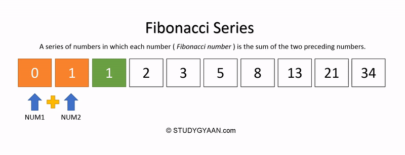

 
 ## _
Generating the nth Fibonacci number_

 

        <kbd></kbd>

 
Per Wikipedia,&nbsp;"In mathematics,&nbsp;the Fibonacci numbers,&nbsp;commonly denoted Fn,&nbsp;form a sequence,&nbsp;called the Fibonacci sequence,&nbsp;such that each number is the sum of the two preceding ones, starting from 0 and 1".  

The initial program I wrote was based on the Binet formula,&nbsp;(see below),&nbsp;which is considered an exact formula for computing the n-th term of the Fibonacci sequence.&nbsp;&nbsp;After testing the program,&nbsp;I found that the precision was off around an input of 50.&nbsp;&nbsp;The datatype used in the program was u128.&nbsp;&nbsp;I assumed the precision loss was due to two mathematical computations;&nbsp;computing the square root and division.&nbsp;&nbsp;Unsatisified with the outcome,&nbsp;I decided to do a little more research.

[_

Binet formula_](https://www.sciencedirect.com/science/article/pii/S0195669807000595#:~:text=In%201843%2C%20Binet%20gave%20a,%5D%2C%20%5B28%5D) 
   
  &#8339;&sup2;&nbsp;&nbsp; &minus;&nbsp;  &#8339; &nbsp;&minus;&nbsp; &#x31;&nbsp;&equals;&nbsp; &#x30; :&nbsp; &alpha;&nbsp; &equals;&nbsp; (&#x31; &plus; &radic;&#x35;)&nbsp;  &divide; &#x32;,&nbsp;  &beta;&nbsp; &equals;&nbsp; (&#x31; &minus; &radic;&#x35;)&nbsp;  &divide; &#x32; 
   
  &gammad;&eta;&nbsp;&equals;&nbsp;(&alpha;&eta;&nbsp;&minus;&nbsp;&beta;&eta;)&nbsp;&divide;&nbsp;(&alpha;&nbsp;&minus;&nbsp;&beta;)
  

   
 I came across an interesting article in Medium on [Memoization in Rust](https://medium.com/swlh/on-memoization-291fd1dd924) written by Andrew Pritchard.&nbsp;&nbsp;Memoization is an optimization technique which is used to speed up the result of a program by storing the result of a computation for the inputted value and then returning the the cached result when the same input occurs again.
  
  
 Using the Fibonacci example in the article,&nbsp;one issue I ran into,&nbsp;again,&nbsp;was the u128 dataype.&nbsp;&nbsp;In using the datatype on this approach,&nbsp;I would receive a panic message of 'attempt to add with overflow' when inputting a value greater than 186.&nbsp;&nbsp;Since I could not figure out how to eloquently handle this error,&nbsp;I hardcoded a fix which I wasn't completely happy with:&nbsp;[see here on line 66](https://github.com/nagashi/nth_fibonacci/blob/main/src/main.rs)&nbsp;.&nbsp;&nbsp;Another issued I found involved the formatting of the output.&nbsp;&nbsp;The formatting library used with the u128 datatype was not applicable for the BigUint datatype.&nbsp;&nbsp;Scrapping this application,&nbsp;I decided the write a new one using the BigUint datatype and developed my own function to format the output into what I consider a more appealing form.&nbsp;&nbsp;The algorithm
constructed for this program is based on the display in the following gif file.
<b>
## _
Algorithm for the Fibonacci sequence_

 

        <kbd></kbd>

  
The way the program is now constructed satisfies my previous concerns:  &nbsp;&nbsp;&nbsp;(1)&nbsp;Allowing the user a wider range of numbers to input. &nbsp;&nbsp;&nbsp;&nbsp;&nbsp;&nbsp;&nbsp;&nbsp;&nbsp;&nbsp;The largest number I tried successfully was 1.6 million. &nbsp;&nbsp;&nbsp;(2)&nbsp;Format the sequence and, if needed, the input number.  The 'formated' function will now accept arguments of type u128 and BigUint.&nbsp;&nbsp;Unfortunately,&nbsp;it will also accept other datatypes as well that could/will cause a problem if the function body is not reconfigured.&nbsp;&nbsp;I could not figure out how to have the function only accept an integer or bigint,&nbsp;but,&nbsp;that's where I am in my learning at this moment,&nbsp;at this time,&nbsp;as I travel through the land of Rust.&nbsp;&nbsp;I'm confident that I'll pick up the knowledge and display remnants of improvement as I travel on down the road.
 
 

Thanks for reading and do reach out and let me know if you have any questions or concerns.&nbsp;&nbsp;All advice, constructive, even non-constructive,&nbsp;is welcome😃.&nbsp;&nbsp;
For those interested in the Fibonacci sequence, [here is a full list of the first 10, 100, and 300 Fibonacci numbers.](https://www.math.net/list-of-fibonacci-numbers)

</body>
</html>

