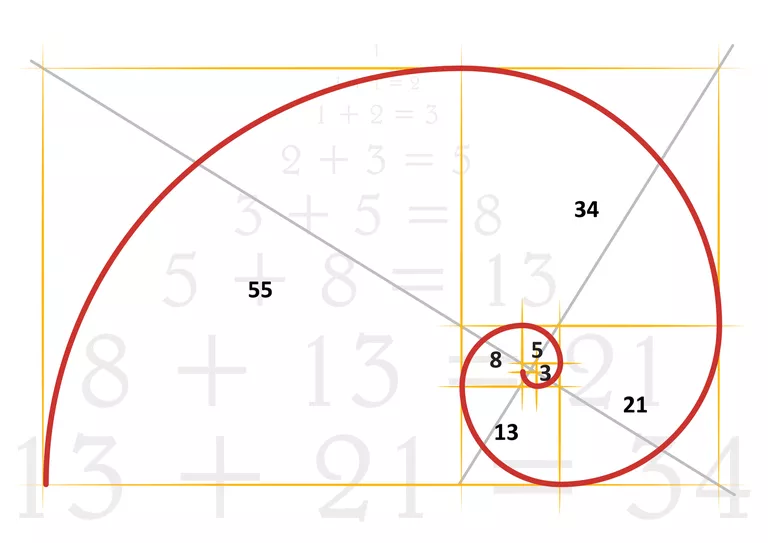

 
 ## _
Generating the nth Fibonacci number_

 

        <kbd></kbd>

 
Per Wikipedia,&nbsp; "In mathematics, the Fibonacci numbers, commonly denoted Fn, form a sequence, called the Fibonacci sequence, such that each number is the sum of the two preceding ones, starting from 0 and 1".  

I initially constructed my code based on the Binet formula,&nbsp;(see below),&nbsp;which is considered an exact formula for computing the n-th term!&nbsp;&nbsp;But,&nbsp;after testing,&nbsp;I found that the precision was off around an input of 50.&nbsp;&nbsp;The datatype used in the initial program was u128.&nbsp;&nbsp;I assumed the precision loss was due to two factors; computing the square root and division.&nbsp;&nbsp;Unsatisified with the outcome of the initial program,&nbsp;I decided to do a little more research.
 

[_

Binet formula_](https://www.sciencedirect.com/science/article/pii/S0195669807000595#:~:text=In%201843%2C%20Binet%20gave%20a,%5D%2C%20%5B28%5D) 
 
  &#8339;&sup2;&nbsp;&nbsp; &minus;&nbsp;  &#8339; &nbsp;&minus;&nbsp; &#x31;&nbsp;&equals;&nbsp; &#x30; :&nbsp; &alpha;&nbsp; &equals;&nbsp; (&#x31; &plus; &radic;&#x35;)&nbsp;  &divide; &#x32;,&nbsp;  &beta;&nbsp; &equals;&nbsp; (&#x31; &minus; &radic;&#x35;)&nbsp;  &divide; &#x32; 
   
  &gammad;&eta;&nbsp;&equals;&nbsp;(&alpha;&eta;&nbsp;&minus;&nbsp;&beta;&eta;)&nbsp;&divide;&nbsp;(&alpha;&nbsp;&minus;&nbsp;&beta;)
 

  

 I came across an interesting article in Medium on [Memoization in Rust](https://medium.com/swlh/on-memoization-291fd1dd924) written by Andrew Pritchard.&nbsp;&nbsp;  Basically,&nbsp;memoization is an optimization technique which is used to speed up the result of a program by storing by storing the results of comptations and then returning the the cached result when the same input occurs again.
  

 Using the Fibonacci example in the article,&nbsp;I ran it through debug to determine exactly what the code was doing.&nbsp;&nbsp;With an input of 10,&nbsp;the code runs from top to bottom,&nbsp;10 -> 0,&nbsp;inputting values into the cache along the way.&nbsp;&nbsp;The code then runs from the bottom back to the top,&nbsp;i.e.,&nbsp;to the value that was inputted and returns the result from the cache.&nbsp;&nbsp;One issue,&nbsp;again,&nbsp; amounted to the u128 dataype.&nbsp;&nbsp;Using this approach,&nbsp;I receive a panic message 'attempt to add with overflow' when inputting a value greater than 186.&nbsp;&nbsp;Since I could not figure out how to eloquently handle this issue,&nbsp;I hardcoded a fix which I wasn't completely happy with (see [here](https://github.com/nagashi/nth_fibonacci/blob/main/src/main.rs)&nbsp;on line 66).&nbsp;&nbsp;

 

https://www.math.net/list-of-fibonacci-numbers
List of Fibonacci numbers
In mathematics, the Fibonacci numbers form a sequence such that each number is the sum of the two preceding numbers, starting from 0 and 1. That is Fn = Fn-1 + Fn-2, where F0 = 0, F1 = 1, and n≥2. The sequence formed by Fibonacci numbers is called the Fibonacci sequence.

The following is a full list of the first 10, 100, and 300 Fibonacci numbers.

The First 10 Fibonacci Numbers
1. 1                            2.     1
3. 2                            4.     3
5. 5                            6.     8
7. 13                           8.    21
9. 34                          10.    55

The First 100 Fibonacci Numbers
The first 100 Fibonacci numbers includes the Fibonacci numbers above and the numbers in this section.

11. 89                          12. 144
13. 233                         14. 377
15. 610                         16. 987
17. 1597                        18. 2584
19. 4181                        20. 6765
21. 10946                       22. 17711
23. 28657                       24. 46368
25. 75025                       26. 121393
27. 196418                      28. 317811
29. 514229                      30. 832040
31. 1346269                     32. 2178309
33. 3524578                     34. 5702887
35. 9227465                     36. 14930352
37. 24157817                    38. 39088169
39. 63245986                    40. 102334155
41. 165580141                   42. 267914296
43. 433494437                   44. 701408733
45. 1134903170                  46. 1836311903
47. 2971215073                  48. 4807526976
49. 7778742049                  50. 12586269025
51. 20365011074                 52. 32951280099
53. 53316291173                 54. 86267571272
55. 139583862445                56. 225851433717
57. 365435296162                58. 591286729879
59. 956722026041                60. 1548008755920
61. 2504730781961               62. 4052739537881
63. 6557470319842               64. 10610209857723
65. 17167680177565              66. 27777890035288
67. 44945570212853              68. 72723460248141
69. 117669030460994             70. 190392490709135
71. 308061521170129             72. 498454011879264
73. 806515533049393             74. 1304969544928657
75. 2111485077978050            76. 3416454622906707
77. 5527939700884757            78. 8944394323791464
79. 14472334024676221           80. 23416728348467685
81. 37889062373143906           82. 61305790721611591
83. 99194853094755497           84. 160500643816367088
85. 259695496911122585          86. 420196140727489673
87. 679891637638612258          88. 1100087778366101931
89. 1779979416004714189         90. 2880067194370816120
91. 4660046610375530309         92. 7540113804746346429
93. 12200160415121876738        94. 19740274219868223167
95. 31940434634990099905        96. 51680708854858323072
97. 83621143489848422977        98. 135301852344706746049
99. 218922995834555169026       100. 354224848179261915075

The First 300 Fibonacci Numbers
The first 300 Fibonacci numbers includes the Fibonacci numbers above and the numbers below.

101. 573147844013817084101
102. 927372692193078999176
103. 1500520536206896083277
104. 2427893228399975082453
105. 3928413764606871165730
106. 6356306993006846248183
107. 10284720757613717413913
108. 16641027750620563662096
109. 26925748508234281076009
110. 43566776258854844738105
111. 70492524767089125814114
112. 114059301025943970552219
113. 184551825793033096366333
114. 298611126818977066918552
115. 483162952612010163284885
116. 781774079430987230203437
117. 1264937032042997393488322
118. 2046711111473984623691759
119. 3311648143516982017180081
120. 5358359254990966640871840
121. 8670007398507948658051921
122. 14028366653498915298923761
123. 22698374052006863956975682
124. 36726740705505779255899443
125. 59425114757512643212875125
126. 96151855463018422468774568
127. 155576970220531065681649693
128. 251728825683549488150424261
129. 407305795904080553832073954
130. 659034621587630041982498215
131. 1066340417491710595814572169
132. 1725375039079340637797070384
133. 2791715456571051233611642553
134. 4517090495650391871408712937
135. 7308805952221443105020355490
136. 11825896447871834976429068427
137. 19134702400093278081449423917
138. 30960598847965113057878492344
139. 50095301248058391139327916261
140. 81055900096023504197206408605
141. 131151201344081895336534324866
142. 212207101440105399533740733471
143. 343358302784187294870275058337
144. 555565404224292694404015791808
145. 898923707008479989274290850145
146. 1454489111232772683678306641953
147. 2353412818241252672952597492098
148. 3807901929474025356630904134051
149. 6161314747715278029583501626149
150. 9969216677189303386214405760200
151. 16130531424904581415797907386349
152. 26099748102093884802012313146549
153. 42230279526998466217810220532898
154. 68330027629092351019822533679447
155. 110560307156090817237632754212345
156. 178890334785183168257455287891792
157. 289450641941273985495088042104137
158. 468340976726457153752543329995929
159. 757791618667731139247631372100066
160. 1226132595394188293000174702095995
161. 1983924214061919432247806074196061
162. 3210056809456107725247980776292056
163. 5193981023518027157495786850488117
164. 8404037832974134882743767626780173
165. 13598018856492162040239554477268290
166. 22002056689466296922983322104048463
167. 35600075545958458963222876581316753
168. 57602132235424755886206198685365216
169. 93202207781383214849429075266681969
170. 150804340016807970735635273952047185
171. 244006547798191185585064349218729154
172. 394810887814999156320699623170776339
173. 638817435613190341905763972389505493
174. 1033628323428189498226463595560281832
175. 1672445759041379840132227567949787325
176. 2706074082469569338358691163510069157
177. 4378519841510949178490918731459856482
178. 7084593923980518516849609894969925639
179. 11463113765491467695340528626429782121
180. 18547707689471986212190138521399707760
181. 30010821454963453907530667147829489881
182. 48558529144435440119720805669229197641
183. 78569350599398894027251472817058687522
184. 127127879743834334146972278486287885163
185. 205697230343233228174223751303346572685
186. 332825110087067562321196029789634457848
187. 538522340430300790495419781092981030533
188. 871347450517368352816615810882615488381
189. 1409869790947669143312035591975596518914
190. 2281217241465037496128651402858212007295
191. 3691087032412706639440686994833808526209
192. 5972304273877744135569338397692020533504
193. 9663391306290450775010025392525829059713
194. 15635695580168194910579363790217849593217
195. 25299086886458645685589389182743678652930
196. 40934782466626840596168752972961528246147
197. 66233869353085486281758142155705206899077
198. 107168651819712326877926895128666735145224
199. 173402521172797813159685037284371942044301
200. 280571172992510140037611932413038677189525
201. 453973694165307953197296969697410619233826
202. 734544867157818093234908902110449296423351
203. 1188518561323126046432205871807859915657177
204. 1923063428480944139667114773918309212080528
205. 3111581989804070186099320645726169127737705
206. 5034645418285014325766435419644478339818233
207. 8146227408089084511865756065370647467555938
208. 13180872826374098837632191485015125807374171
209. 21327100234463183349497947550385773274930109
210. 34507973060837282187130139035400899082304280
211. 55835073295300465536628086585786672357234389
212. 90343046356137747723758225621187571439538669
213. 146178119651438213260386312206974243796773058
214. 236521166007575960984144537828161815236311727
215. 382699285659014174244530850035136059033084785
216. 619220451666590135228675387863297874269396512
217. 1001919737325604309473206237898433933302481297
218. 1621140188992194444701881625761731807571877809
219. 2623059926317798754175087863660165740874359106
220. 4244200115309993198876969489421897548446236915
221. 6867260041627791953052057353082063289320596021
222. 11111460156937785151929026842503960837766832936
223. 17978720198565577104981084195586024127087428957
224. 29090180355503362256910111038089984964854261893
225. 47068900554068939361891195233676009091941690850
226. 76159080909572301618801306271765994056795952743
227. 123227981463641240980692501505442003148737643593
228. 199387062373213542599493807777207997205533596336
229. 322615043836854783580186309282650000354271239929
230. 522002106210068326179680117059857997559804836265
231. 844617150046923109759866426342507997914076076194
232. 1366619256256991435939546543402365995473880912459
233. 2211236406303914545699412969744873993387956988653
234. 3577855662560905981638959513147239988861837901112
235. 5789092068864820527338372482892113982249794889765
236. 9366947731425726508977331996039353971111632790877
237. 15156039800290547036315704478931467953361427680642
238. 24522987531716273545293036474970821924473060471519
239. 39679027332006820581608740953902289877834488152161
240. 64202014863723094126901777428873111802307548623680
241. 103881042195729914708510518382775401680142036775841
242. 168083057059453008835412295811648513482449585399521
243. 271964099255182923543922814194423915162591622175362
244. 440047156314635932379335110006072428645041207574883
245. 712011255569818855923257924200496343807632829750245
246. 1152058411884454788302593034206568772452674037325128
247. 1864069667454273644225850958407065116260306867075373
248. 3016128079338728432528443992613633888712980904400501
249. 4880197746793002076754294951020699004973287771475874
250. 7896325826131730509282738943634332893686268675876375
251. 12776523572924732586037033894655031898659556447352249
252. 20672849399056463095319772838289364792345825123228624
253. 33449372971981195681356806732944396691005381570580873
254. 54122222371037658776676579571233761483351206693809497
255. 87571595343018854458033386304178158174356588264390370
256. 141693817714056513234709965875411919657707794958199867
257. 229265413057075367692743352179590077832064383222590237
258. 370959230771131880927453318055001997489772178180790104
259. 600224643828207248620196670234592075321836561403380341
260. 971183874599339129547649988289594072811608739584170445
261. 1571408518427546378167846658524186148133445300987550786
262. 2542592393026885507715496646813780220945054040571721231
263. 4114000911454431885883343305337966369078499341559272017
264. 6656593304481317393598839952151746590023553382130993248
265. 10770594215935749279482183257489712959102052723690265265
266. 17427187520417066673081023209641459549125606105821258513
267. 28197781736352815952563206467131172508227658829511523778
268. 45624969256769882625644229676772632057353264935332782291
269. 73822750993122698578207436143903804565580923764844306069
270. 119447720249892581203851665820676436622934188700177088360
271. 193270471243015279782059101964580241188515112465021394429
272. 312718191492907860985910767785256677811449301165198482789
273. 505988662735923140767969869749836918999964413630219877218
274. 818706854228831001753880637535093596811413714795418360007
275. 1324695516964754142521850507284930515811378128425638237225
276. 2143402371193585144275731144820024112622791843221056597232
277. 3468097888158339286797581652104954628434169971646694834457
278. 5611500259351924431073312796924978741056961814867751431689
279. 9079598147510263717870894449029933369491131786514446266146
280. 14691098406862188148944207245954912110548093601382197697835
281. 23770696554372451866815101694984845480039225387896643963981
282. 38461794961234640015759308940939757590587318989278841661816
283. 62232491515607091882574410635924603070626544377175485625797
284. 100694286476841731898333719576864360661213863366454327287613
285. 162926777992448823780908130212788963731840407743629812913410
286. 263621064469290555679241849789653324393054271110084140201023
287. 426547842461739379460149980002442288124894678853713953114433
288. 690168906931029935139391829792095612517948949963798093315456
289. 1116716749392769314599541809794537900642843628817512046429889
290. 1806885656323799249738933639586633513160792578781310139745345
291. 2923602405716568564338475449381171413803636207598822186175234
292. 4730488062040367814077409088967804926964428786380132325920579
293. 7654090467756936378415884538348976340768064993978954512095813
294. 12384578529797304192493293627316781267732493780359086838016392
295. 20038668997554240570909178165665757608500558774338041350112205
296. 32423247527351544763402471792982538876233052554697128188128597
297. 52461916524905785334311649958648296484733611329035169538240802
298. 84885164052257330097714121751630835360966663883732297726369399
299. 137347080577163115432025771710279131845700275212767467264610201
300. 222232244629420445529739893461909967206666939096499764990979600

</body>
</html>

