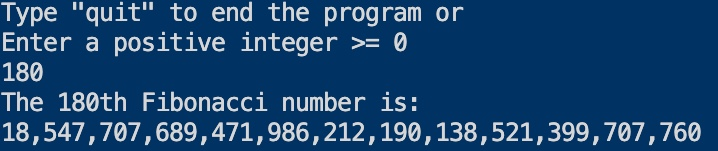

 
 ## _
Generating the nth Fibonacci number_

 

        <kbd></kbd>

 
Per Wikipedia, "In mathematics, the Fibonacci numbers, commonly denoted Fn,&nbsp;form a sequence, called the Fibonacci sequence, such that each number is the sum of the two preceding ones, starting from 0 and 1".  

The initial program I wrote was based on the Binet formula, (see below), which is considered an exact formula for computing the n-th term of the Fibonacci sequence.&nbsp;&nbsp;After testing the program, I found that the precision was off around an input of 50.&nbsp;&nbsp;The datatype used in the program was u128.&nbsp;&nbsp;I assumed the precision loss was due to two mathematical computations; computing the square root and division.&nbsp;&nbsp;Unsatisified with the outcome, I decided to do a little more research.

[_

Binet formula_](https://www.sciencedirect.com/science/article/pii/S0195669807000595#:~:text=In%201843%2C%20Binet%20gave%20a,%5D%2C%20%5B28%5D) 
   
  &#8339;&sup2;&nbsp;&nbsp; &minus;&nbsp;  &#8339; &nbsp;&minus;&nbsp; &#x31;&nbsp;&equals;&nbsp; &#x30; :&nbsp; &alpha;&nbsp; &equals;&nbsp; (&#x31; &plus; &radic;&#x35;)&nbsp;  &divide; &#x32;,&nbsp;  &beta;&nbsp; &equals;&nbsp; (&#x31; &minus; &radic;&#x35;)&nbsp;  &divide; &#x32; 
   
  &gammad;&eta;&nbsp;&equals;&nbsp;(&alpha;&eta;&nbsp;&minus;&nbsp;&beta;&eta;)&nbsp;&divide;&nbsp;(&alpha;&nbsp;&minus;&nbsp;&beta;)
  

   
 I came across an interesting article in Medium on [Memoization in Rust](https://medium.com/swlh/on-memoization-291fd1dd924) written by Andrew Pritchard.&nbsp;&nbsp;Memoization is an optimization technique which is used to speed up the result of a program by storing the result of a computation for the inputted value and then returning the cached result when the same input occurs again.
  
  
 Using the Fibonacci example in the article, one issue I ran into, again, was the u128 dataype.&nbsp;&nbsp;In using the datatype with the memoization approach, I would receive a panic message of 'attempt to add with overflow' when inputting a value greater than 186.&nbsp;&nbsp;Since I could not figure out how to eloquently handle this error,&nbsp;I hardcoded a fix which I wasn't completely happy with:&nbsp;[see here on line 66](https://github.com/nagashi/nth_fibonacci/blob/main/src/main.rs)&nbsp;.&nbsp;&nbsp;Another issue I found involved the formatting of the output.&nbsp;&nbsp;The formatting library used with the u128 datatype was not applicable for the BigUint datatype.&nbsp;&nbsp;I had an idea how I wanted the program to function and what i wanted the output to look like so I scrapped the application and decided to write a new program using the BigUint datatype and develope my own function to format the output into what I consider a more appealing form.&nbsp;&nbsp;The algorithm in the new program is based on the display below with a sample output beneath it.
<b>
## _
Algorithm for the Fibonacci sequence_

 

        <kbd></kbd>

 
<b>

## _
The 180th Fibonacci number_

 

        <kbd></kbd>

 

The way the program is now constructed satisfies my previous concerns:  &nbsp;&nbsp;&nbsp;(1)&nbsp;Allowing the user a wider range of numbers to input. &nbsp;&nbsp;&nbsp;&nbsp;&nbsp;&nbsp;&nbsp;&nbsp;&nbsp;&nbsp;The largest number I tried successfully was 1.6 million. &nbsp;&nbsp;&nbsp;(2)&nbsp;Format the Fibonacci Sequence and the user input.  The 'formated' function has been implemented on both the u128 and BigUint datatypes.&nbsp;&nbsp;This allows each of the mentioned dataypes to now have the capability to call the formated function on its own value.  The source code can be viewed in the [src/main](https://github.com/nagashi/generate_nth_fibonacci/blob/main/src/main.rs) folder for those unfamiliar with the Rust language.
 
 

Thanks for reading and do reach out and let me know if you have any questions or concerns.&nbsp;&nbsp;All suggestions, constructive, even non-constructive,&nbsp;will be welcoming😃. 
For those interested in the Fibonacci sequence, here is a full list of the first [10, 100, and 300 Fibonacci numbers.](https://www.math.net/list-of-fibonacci-numbers)

</body>
</html>

